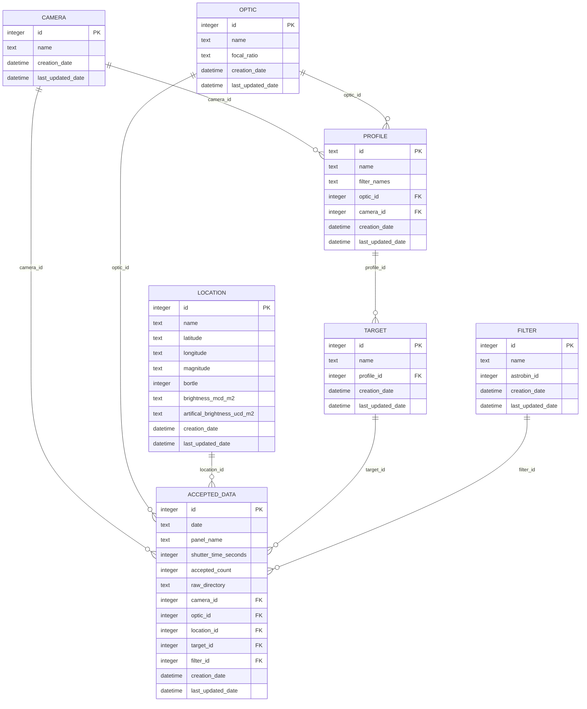

# Database Schema Documentation

This document describes the schema for `astrophotography.sqlite`, which tracks imaging equipment, sessions, and data quality for astrophotography workflow management.

## Entity Relationship Diagram



## Table Descriptions

### Core Equipment Tables

#### `camera`
Represents imaging cameras used in astrophotography rigs.
- **Primary Key**: `id` (integer)
- **Unique Constraint**: `name`
- **Purpose**: Track different camera models (e.g., "ASI2600MM", "Canon T2i")

#### `optic`
Represents telescopes, lenses, and other optical equipment.
- **Primary Key**: `id` (integer)
- **Unique Constraint**: `name + focal_ratio`
- **Purpose**: Track optical equipment with specific focal ratios (e.g., "RC8" at f/8.0)

#### `filter`
Represents imaging filters used for different wavelengths.
- **Primary Key**: `id` (integer)
- **Unique Constraint**: `name`
- **Fields**: Includes optional `astrobin_id` for integration with AstroBin
- **Purpose**: Track filters like "Ha", "OIII", "RGB", etc.

### Configuration Tables

#### `profile`
Links optic and camera combinations with available filters.
- **Primary Key**: `id` (text)
- **Unique Constraints**: 
  - `optic_id + camera_id` (one profile per rig)
  - `name` (unique profile names)
- **Relationships**: 
  - References `optic` and `camera`
  - Referenced by `target`
- **Purpose**: Represents a "rig" configuration with available filter set

#### `location`
Represents imaging locations with light pollution data.
- **Primary Key**: `id` (integer)
- **Unique Constraint**: `latitude + longitude`
- **Fields**: Includes Bortle scale and brightness measurements
- **Purpose**: Track imaging site quality and conditions

#### `target`
Represents astronomical targets being imaged.
- **Primary Key**: `id` (integer)
- **Unique Constraint**: `name`
- **Relationships**: Optional reference to `profile`
- **Purpose**: Track different deep-sky objects or targets

### Data Tracking Tables

#### `accepted_data`
Records imaging sessions with quality metrics and file counts.
- **Primary Key**: `id` (integer)
- **Unique Constraints**: 
  - Complete session signature: `camera_id + optic_id + location_id + target_id + filter_id + date + panel_name + shutter_time_seconds + raw_directory`
  - `raw_directory` (prevents duplicate imports)
- **Relationships**: References all core entities
- **Fields**:
  - `date`: Imaging session date
  - `panel_name`: For mosaic panels (optional)
  - `shutter_time_seconds`: Exposure time
  - `accepted_count`: Number of accepted frames
  - `raw_directory`: Source directory path
- **Purpose**: Central fact table linking all equipment/conditions with actual imaging data

## Key Design Patterns

### Equipment Hierarchy
1. **Optic + Camera = Profile** (represents a "rig")
2. **Profile can be associated with targets** (planning/configuration)
3. **All equipment referenced in actual sessions** (accepted_data)

### Data Lineage
- `raw_directory` field provides traceability back to original NINA data
- Unique constraints prevent duplicate data import
- Timestamps track creation and modification

### Workflow Integration
- **Current**: Database tracks results after blink/acceptance phase
- **Future**: Could be extended to track workflow state transitions
- **Planning**: Profile/target relationships support session planning

## Usage Patterns

### Rig Identification
Rigs are identified by the combination of:
```sql
SELECT o.name || '@f' || o.focal_ratio || '+' || c.name as rig_name
FROM profile p
JOIN optic o ON p.optic_id = o.id  
JOIN camera c ON p.camera_id = c.id
```

### Session Data
Imaging sessions are recorded with full equipment context:
```sql
SELECT ad.date, t.name as target, f.name as filter, 
       ad.shutter_time_seconds, ad.accepted_count,
       o.name || '@f' || o.focal_ratio || '+' || c.name as rig
FROM accepted_data ad
JOIN target t ON ad.target_id = t.id
JOIN filter f ON ad.filter_id = f.id
JOIN optic o ON ad.optic_id = o.id
JOIN camera c ON ad.camera_id = c.id
```

## Future Considerations

### Potential Extensions
1. **Configuration Table**: Store rig-specific culling thresholds (HFR, RMS)
2. **Workflow State**: Track project progression through workflow stages
3. **Session Planning**: Expand target/profile relationships for planning
4. **Quality Metrics**: Store detailed image quality statistics
5. **Weather Data**: Link sessions with weather conditions

### Integration Points
- **NINA Integration**: Could import NINA profiles and equipment configs
- **AstroBin Integration**: `astrobin_id` fields ready for API integration
- **Planning Tools**: Profile/target relationships support session planning
- **Quality Analysis**: Accepted counts and directory tracking enable analysis