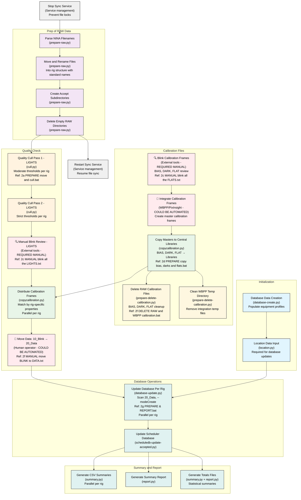

# Astrophotography Data Management Process Summary

This document outlines the complete functional process for managing astrophotography data from raw capture through organized archival.

**Note**: Complete system context and requirements for future LLM sessions are captured in `docs/LLM_CONTEXT.md`.

## Process Overview

The process follows a sequence designed to transform raw NINA output into organized, quality-filtered, and database-tracked imaging data.

## Process Operation Sequence

The following Mermaid diagram shows the discrete operations and their dependencies. Operations that can run in parallel are shown at the same level, while sequential dependencies are connected with arrows.



- 🔍 REQUIRED MANUAL: Blink operations (lights and calibration)
- 🔄 COULD BE AUTOMATED: Calibration integration, Data movement (10_Blink → 20_Data)

## Discrete Operations Breakdown

### **Initialization** (Reference: `1a. UPSERT db astrophotography create with profiles.bat`)

#### **Database Data Creation**
- **Operation**: `database-create.py`
- **Purpose**: Creates/updates the astrophotography.sqlite database and populates equipment profiles
- **Dependencies**: None (initialization step)
- **Parallelization**: Sequential with Location Data Population

**Tasks:**
1. **Initialize Database Connection** ([database-create.py:9-15](https://github.com/jewzaam/astrophotography-data-management/blob/main/reference/scripts/database-create.py#L9-L15))
   - Connect to astrophotography.sqlite database
   - Disable auto-commit for transaction control
   - Enable case-sensitive LIKE operations

2. **Create Database Schema** ([database-create.py:17](https://github.com/jewzaam/astrophotography-data-management/blob/main/reference/scripts/database-create.py#L17), [database.py:369-372](https://github.com/jewzaam/astrophotography-data-management/blob/main/reference/scripts/database.py#L369-L372), [database.py:253-331](https://github.com/jewzaam/astrophotography-data-management/blob/main/reference/scripts/database.py#L253-L331))
   - Create `camera` table with unique name index
   - Create `optic` table with unique name+focal_ratio index  
   - Create `profile` table with unique optic_id+camera_id and name indexes
   - Create `location` table with unique latitude+longitude index
   - Create `target` table with unique name index
   - Create `filter` table with unique name index
   - Create `accepted_data` table with foreign key constraints and unique indexes
   - All tables include automatic timestamps (creation_date, last_updated_date)

3. **Process NINA Profile Files** ([database-create.py:18-20](https://github.com/jewzaam/astrophotography-data-management/blob/main/reference/scripts/database-create.py#L18-L20), [database.py:374-459](https://github.com/jewzaam/astrophotography-data-management/blob/main/reference/scripts/database.py#L374-L459))
   - Scan NINA profiles directory for .profile files
   - Parse XML profile files to extract equipment and filter information
   - Extract profile ID, name, and filter wheel configuration
   - Parse profile name format: `<optic>@f<ratio>+<camera>` ([database.py:424-430](https://github.com/jewzaam/astrophotography-data-management/blob/main/reference/scripts/database.py#L424-L430))
   - **Issue**: Currently fails on malformed profile names, preventing processing of remaining valid profiles
   - Insert/update optic and camera records ([database.py:432-435](https://github.com/jewzaam/astrophotography-data-management/blob/main/reference/scripts/database.py#L432-L435))
   - Create filter priority list, reordering O,S,H filters for priority ([database.py:420-422](https://github.com/jewzaam/astrophotography-data-management/blob/main/reference/scripts/database.py#L420-L422))
   - Upsert profile records with equipment relationships ([database.py:437-455](https://github.com/jewzaam/astrophotography-data-management/blob/main/reference/scripts/database.py#L437-L455))

4. **Create Default Filters** ([database-create.py:21](https://github.com/jewzaam/astrophotography-data-management/blob/main/reference/scripts/database-create.py#L21), [database.py:461-475](https://github.com/jewzaam/astrophotography-data-management/blob/main/reference/scripts/database.py#L461-L475))
   - Insert standard astrophotography filters: L, R, G, B, S, H, O, UVIR ([database.py:342-350](https://github.com/jewzaam/astrophotography-data-management/blob/main/reference/scripts/database.py#L342-L350))
   - Include AstroBin ID mappings for each filter
   - Use ON CONFLICT clause to update existing filters

5. **Commit Transaction** ([database-create.py:23-24](https://github.com/jewzaam/astrophotography-data-management/blob/main/reference/scripts/database-create.py#L23-L24))
   - Commit all changes as single transaction
   - Close database connection properly

#### **Location Data Input**
- **Operation**: `location.py`
- **Purpose**: Populates location data tables required for database updates
- **Dependencies**: Database Data Creation
- **Parallelization**: None

**Tasks:**
1. **Initialize Predefined Locations** ([location.py:96-103](https://github.com/jewzaam/astrophotography-data-management/blob/main/reference/scripts/location.py#L96-L103))
   - Define list of astrophotography locations with coordinates:
     - RL: 35.6°N, 78.8°W
     - BW: 35.8°N, 79.0°W  
     - 3BA: 36.1°N, 78.7°W
     - SRSP: 36.7°N, 78.7°W
     - HW: 35.4°N, 78.3°W
     - KDDS: 39.6°N, 104.0°W

2. **Fetch Sky Quality Data from API** ([location.py:36-61](https://github.com/jewzaam/astrophotography-data-management/blob/main/reference/scripts/location.py#L36-L61), [location.py:114-124](https://github.com/jewzaam/astrophotography-data-management/blob/main/reference/scripts/location.py#L114-L124))
   - Query Clear Outside API for each location: `https://clearoutside.com/forecast/{lat}/{lon}`
   - Parse HTML response to extract sky quality metrics
   - Extract magnitude rating (sky brightness estimate)
   - Extract Bortle class (1-9 light pollution scale)
   - Extract brightness in mcd/m² (natural sky brightness)
   - Extract artificial brightness in μcd/m² (light pollution level)
   - Enforce 15-second delay between API calls for rate limiting
   - **Issue**: Brittle HTML parsing dependent on Clear Outside site structure

3. **Generate Location Database Updates** ([location.py:63-93](https://github.com/jewzaam/astrophotography-data-management/blob/main/reference/scripts/location.py#L63-L93), [location.py:126-136](https://github.com/jewzaam/astrophotography-data-management/blob/main/reference/scripts/location.py#L126-L136))
   - Create SQL UPSERT statements for each location
   - Use latitude+longitude as unique conflict resolution
   - Update all sky quality fields while preserving coordinates

4. **Execute Database Updates** ([location.py:148-161](https://github.com/jewzaam/astrophotography-data-management/blob/main/reference/scripts/location.py#L148-L161))
   - Connect to astrophotography.sqlite database
   - Execute all location UPSERT statements
   - Commit changes as single transaction
   - Handle exceptions and ensure proper connection cleanup

---

### **Prep of RAW Data** (Reference: `2a. PREPARE move and cull.bat`)

#### **Parse NINA Filenames**
- **Operation**: `prepare-raw.py`
- **Purpose**: Extract metadata from NINA filename patterns and organize files by type
- **Dependencies**: RAW files from NINA
- **Parallelization**: None (sequential within prepare-raw.py)

**Tasks:**
1. **Initialize File Processing Parameters** ([prepare-raw.py:11-31](https://github.com/jewzaam/astrophotography-data-management/blob/main/reference/scripts/prepare-raw.py#L11-L31))
   - Parse command line arguments for input/output directories
   - Set input directory (default: RAW root)
   - Set output directories for each frame type (BIAS, DARK, FLAT, LIGHT)
   - Configure debug and dry-run modes

2. **Process Each Frame Type Sequentially** ([prepare-raw.py:44-47](https://github.com/jewzaam/astrophotography-data-management/blob/main/reference/scripts/prepare-raw.py#L44-L47), [filesystem.py:99-112](https://github.com/jewzaam/astrophotography-data-management/blob/main/reference/scripts/filesystem.py#L99-L112))
   - Process BIAS frames (no recursion, no status output)
   - Process DARK frames (no recursion, no status output) 
   - Process FLAT frames (no recursion, no status output)
   - Process LIGHT frames (with recursion, with status output)
   - **Processing order is critical**: BIAS → DARK → FLAT → LIGHT (supports dark scaling workflow: darks+bias→flats, darks+bias+flats→lights)
   - Delete empty directories after LIGHT processing only

#### **Move and Rename Files**
- **Operation**: Internal `_prepare` method for each frame type
- **Purpose**: Move files into rig-based directory structure with standardized naming
- **Dependencies**: Parse NINA Filenames
- **Parallelization**: None (sequential within prepare-raw.py)
- **Note**: File move and rename happen simultaneously - destination path includes new filename

**Tasks:**
1. **Extract Required Metadata per Frame Type** ([filesystem.py:34-54](https://github.com/jewzaam/astrophotography-data-management/blob/main/reference/scripts/filesystem.py#L34-L54))
   - **BIAS/DARK**: camera, type, date, exposureseconds, datetime, filename
   - **FLAT**: Add optic, focal_ratio, filter
   - **LIGHT**: Add optic, focal_ratio, filter, targetname
   - Filter files by frame type using metadata

2. **Scan and Filter Files** ([common.py:514-543](https://github.com/jewzaam/astrophotography-data-management/blob/main/reference/scripts/common.py#L514-L543))
   - Search input directory for FITS files matching pattern
   - Extract FITS header metadata for each file
   - Filter files based on frame type and required properties
   - Return metadata dictionary for matching files

3. **Generate Standardized Filenames** ([common.py:231-288](https://github.com/jewzaam/astrophotography-data-management/blob/main/reference/scripts/common.py#L231-L288))
   - Build output path: `{output_dir}/{rig}/{workflow_dir}/{target}/DATE_{date}/FILTER_{filter}_EXP_{exp}_{datetime}_{metadata}.fits`
   - **BIAS/DARK/FLAT**: `{optic}+{camera}` (no focal ratio)
   - **LIGHT**: `{optic}@f{focal_ratio}+{camera}` and add `10_Blink` workflow directory
   - Include exposure time, temperature, panel info, quality metrics (HFR, stars, RMS, temp)
   - Accept any values from FITS headers without validation
   - Preserve original file extension

4. **Execute File Moves** ([filesystem.py:64-94](https://github.com/jewzaam/astrophotography-data-management/blob/main/reference/scripts/filesystem.py#L64-L94), [common.py:477-512](https://github.com/jewzaam/astrophotography-data-management/blob/main/reference/scripts/common.py#L477-L512))
   - Create destination directory structure as needed
   - Copy file to new location with standardized name
   - Delete original file after successful copy
   - Display progress indicators (every 50 files for LIGHT frames only)
   - **Error handling**: Retry once on failure, then fail and report (retry logic to be implemented)

#### **Create Accept Subdirectories**
- **Operation**: Automatic during file move process
- **Purpose**: Create accept subdirectories for workflow
- **Dependencies**: Move and Rename Files
- **Parallelization**: None (sequential within prepare-raw.py)

**Tasks:**
1. **Identify Target Directories** ([filesystem.py:90-94](https://github.com/jewzaam/astrophotography-data-management/blob/main/reference/scripts/filesystem.py#L90-L94))
   - Extract parent directories from destination paths (above DATE level)
   - Track unique target directories across all processed files

2. **Create Accept Subdirectories** ([filesystem.py:92-93](https://github.com/jewzaam/astrophotography-data-management/blob/main/reference/scripts/filesystem.py#L92-L93))
   - Create `accept` subdirectory in each target directory
   - Use mkdir with parents=True for resilient directory creation

#### **Delete Empty RAW Directories**
- **Operation**: Final cleanup in LIGHT processing
- **Purpose**: Clean up empty source directories and trigger service restart
- **Dependencies**: Create Accept Subdirectories
- **Parallelization**: None (sequential within prepare-raw.py)
- **Note**: Triggers sync service restart after RAW processing is complete

**Tasks:**
1. **Recursively Remove Empty Directories** ([common.py:1045-1065](https://github.com/jewzaam/astrophotography-data-management/blob/main/reference/scripts/common.py#L1045-L1065))
   - Start from input root directory
   - Walk directory tree bottom-up
   - Attempt to remove each directory (fails if not empty)
   - Repeat until no more directories can be removed
   - Preserve directories with `.keep` files or other content

---

### **Calibration Files** (Reference: `2c. MANUAL blink all the FLATS.txt`, `2d. PREPARE copy bias, darks and flats.bat`, `2f. DELETE RAW and WBPP calibration.bat`)

#### **Blink Calibration Frames** (Required Manual)
- **Operation**: External blink software or PixInsight
- **Purpose**: Human review of BIAS, DARK, FLAT frames for quality and uniformity
- **Dependencies**: RAW calibration files available
- **Parallelization**: Can review different calibration types simultaneously
- **Note**: Instruction files currently empty, relies on operator experience

**Tasks:**
1. **Manual Review Process** (Reference: [2c. MANUAL blink all the FLATS.txt](https://github.com/jewzaam/astrophotography-data-management/blob/main/reference/2c.%20MANUAL%20blink%20all%20the%20FLATS.txt))
   - Open PixInsight and load calibration frames (BIAS, DARK, FLAT)
   - Use blink functionality to identify defective frames
   - Remove frames with dust spots, gradient issues, or other artifacts
   - Verify sufficient frame count for robust master creation
   - **Note**: Specific procedures not documented in reference files (relies on operator experience)

#### **Integrate Calibration Frames** (Could Be Automated)
- **Operation**: WBPP/PixInsight
- **Purpose**: Create master calibration frames from reviewed individual frames
- **Dependencies**: Blink Calibration Frames
- **Parallelization**: Can process different calibration types in parallel
- **Note**: Could be automated via WBPP/PixInsight scripting

**Tasks:**
1. **Execute WBPP Integration Process**
   - Configure WeightedBatchPreprocessing (WBPP) in PixInsight
   - Set up master frame generation for BIAS, DARK, FLAT
   - Apply dark scaling workflow: darks+bias→flats, darks+bias+flats→lights
   - Generate master frames in `.xisf` format
   - Save to WBPP calibration directory (`C:\tmp_pi\WBPP\_calibration\master`)
   - **Note**: Standard WBPP configuration available in `reference/WBPP.xpsm` but should be user-configurable per frame type

#### **Copy Masters to Central Libraries**
- **Operation**: `copycalibration.py`
- **Purpose**: Archive master BIAS, DARK, FLAT from WBPP temp to central libraries
- **Dependencies**: Integrate Calibration Frames
- **Parallelization**: None (single operation)
- **Output Libraries**: `_Bias Library`, `_Dark Library`, `_Flat Stash`

**Tasks:**
1. **Copy Master BIAS Frames** ([copycalibration.py:108-150](https://github.com/jewzaam/astrophotography-data-management/blob/main/reference/scripts/copycalibration.py#L108-L150), [2d. PREPARE copy bias, darks and flats.bat:2](https://github.com/jewzaam/astrophotography-data-management/blob/main/reference/2d.%20PREPARE%20copy%20bias,%20darks%20and%20flats.bat#L2))
   - Search WBPP calibration directory for `MASTER BIAS` type files (`.xisf` format)
   - Copy to central BIAS library (`_Bias Library`)
   - Skip existing files to prevent overwrites
   - Apply filters: type, exposureseconds, settemp, camera, gain, offset, readoutmode

2. **Copy Master DARK Frames** ([copycalibration.py:152-194](https://github.com/jewzaam/astrophotography-data-management/blob/main/reference/scripts/copycalibration.py#L152-L194), [2d. PREPARE copy bias, darks and flats.bat:2](https://github.com/jewzaam/astrophotography-data-management/blob/main/reference/2d.%20PREPARE%20copy%20bias,%20darks%20and%20flats.bat#L2))
   - Search WBPP calibration directory for `MASTER DARK` type files (`.xisf` format)
   - Copy to central DARK library (`_Dark Library`)
   - Skip existing files to prevent overwrites
   - Apply filters: type, exposureseconds, settemp, camera, gain, offset, readoutmode

3. **Copy Master FLAT Frames** ([copycalibration.py:196-248](https://github.com/jewzaam/astrophotography-data-management/blob/main/reference/scripts/copycalibration.py#L196-L248), [2d. PREPARE copy bias, darks and flats.bat:2](https://github.com/jewzaam/astrophotography-data-management/blob/main/reference/2d.%20PREPARE%20copy%20bias,%20darks%20and%20flats.bat#L2))
   - Search WBPP calibration directory for `MASTER FLAT` type files (`.xisf` format)
   - Copy to central FLAT stash (`_Flat Stash`)
   - Skip existing files to prevent overwrites
   - Apply filters: type, camera, optic, date, filter, settemp, gain, offset, focallen, readoutmode
   - Fix DATE-OBS to DATE mapping issue during copy

#### **Delete RAW Calibration Files** (Independent cleanup)
- **Operation**: `prepare-delete-calibration.py`
- **Purpose**: Remove RAW calibration files after masters are safely archived
- **Dependencies**: Copy Masters to Central Libraries
- **Parallelization**: None (sequential: BIAS → DARK → FLAT)
- **Note**: Independent of main workflow, runs in parallel with other operations

**Tasks:**
1. **Delete RAW Calibration Files by Type** ([prepare-delete-calibration.py:28-37](https://github.com/jewzaam/astrophotography-data-management/blob/main/reference/scripts/prepare-delete-calibration.py#L28-L37), [2f. DELETE RAW and WBPP calibration.bat:4-6](https://github.com/jewzaam/astrophotography-data-management/blob/main/reference/2f.%20DELETE%20%20RAW%20and%20WBPP%20calibration.bat#L4-L6))
   - Stop Dropbox service to prevent file locks
   - Delete BIAS files from RAW/BIAS directory
   - Delete DARK files from RAW/DARK directory
   - Delete FLAT files from RAW/FLAT directory
   - Use filesystem.Delete class with pattern matching (`.fits` and `.xisf` files)
   - Remove empty directories after deletion

#### **Clean WBPP Temp Directory** (Independent cleanup)
- **Operation**: `prepare-delete-calibration.py`
- **Purpose**: Clean WBPP temporary calibration directory
- **Dependencies**: Copy Masters to Central Libraries
- **Parallelization**: None
- **Note**: Independent of main workflow, runs in parallel with other operations

**Tasks:**
1. **Wipe WBPP Calibration Directory** ([prepare-delete-calibration.py:39-42](https://github.com/jewzaam/astrophotography-data-management/blob/main/reference/scripts/prepare-delete-calibration.py#L39-L42), [2f. DELETE RAW and WBPP calibration.bat:4-6](https://github.com/jewzaam/astrophotography-data-management/blob/main/reference/2f.%20DELETE%20%20RAW%20and%20WBPP%20calibration.bat#L4-L6))
   - Recursively delete entire WBPP calibration directory (`C:\tmp_pi\WBPP\_calibration`)
   - Recreate empty calibration directory structure
   - Restart Dropbox service after cleanup completion
   - **Note**: Complete directory wipe removes all integration artifacts and temp files

#### **Distribute Calibration Frames** (Can run parallel per rig)
- **Operation**: `copycalibration.py` per rig
- **Purpose**: Match and distribute calibration frames to rig-specific light datasets
- **Dependencies**: Copy Masters to Central Libraries + Quality Check completion (LIGHTS must be in blink directory)
- **Parallelization**: Can be parallelized per rig

**Tasks:**
1. **Distribute DARK Frames per Rig** ([copycalibration.py:250-293](https://github.com/jewzaam/astrophotography-data-management/blob/main/reference/scripts/copycalibration.py#L250-L293), [2d. PREPARE copy bias, darks and flats.bat:5,8,11](https://github.com/jewzaam/astrophotography-data-management/blob/main/reference/2d.%20PREPARE%20copy%20bias,%20darks%20and%20flats.bat#L5,L8,L11))
   - Scan LIGHT frames in rig's `10_Blink` directory to determine requirements
   - Extract required properties per rig:
     - **C8E@f10+ZWO ASI2600MM Pro**: exposureseconds, settemp, camera, gain, offset, type
     - **SQA55@f5.3+ATR585M**: exposureseconds, settemp, camera, gain, offset, type, readoutmode
     - **DWARFIII@f4.3+DWARFIII**: exposureseconds, camera, gain, type
   - Match DARK masters from library using required properties
   - Copy matching DARKs to each DATE directory containing LIGHT frames
   - Report missing calibration files as warnings

2. **Distribute FLAT Frames per Rig** ([copycalibration.py:296-340](https://github.com/jewzaam/astrophotography-data-management/blob/main/reference/scripts/copycalibration.py#L296-L340), [2d. PREPARE copy bias, darks and flats.bat:5,8,11](https://github.com/jewzaam/astrophotography-data-management/blob/main/reference/2d.%20PREPARE%20copy%20bias,%20darks%20and%20flats.bat#L5,L8,L11))
   - Scan LIGHT frames in rig's `10_Blink` directory to determine requirements
   - Extract required properties per rig:
     - **C8E@f10+ZWO ASI2600MM Pro**: date, optic, filter, settemp, camera, gain, offset, type
     - **SQA55@f5.3+ATR585M**: date, optic, filter, settemp, camera, gain, offset, type, readoutmode
     - **DWARFIII@f4.3+DWARFIII**: date, optic, filter, camera, gain, type
   - Match FLAT masters from WBPP calibration directory using required properties
   - Copy matching FLATs to each DATE directory containing LIGHT frames
   - Report missing calibration files as warnings

3. **Execute Calibration Matching Logic** ([copycalibration.py:342-427](https://github.com/jewzaam/astrophotography-data-management/blob/main/reference/scripts/copycalibration.py#L342-L427))
   - Group LIGHT frames by directory to build filter requirements
   - Filter calibration files to match each LIGHT frame directory's requirements
   - Ensure exactly 0 or 1 calibration match per requirement set (fail with error if multiple matches)
   - Build copy list for each matching calibration file
   - Place calibration files at DATE directory level (same as LIGHT frames)

---

### **Quality Check** (Reference: `2a. PREPARE move and cull.bat`, `2c. MANUAL blink all the LIGHTS.txt`, `2d. PREPARE copy bias, darks and flats.bat`, `2f. MANUAL move BLINK to DATA.txt`)

#### **Quality Cull Pass 1 - LIGHTS** (Can run in parallel per rig)
- **Operation**: `cull.py` with moderate thresholds
- **Purpose**: Initial quality filtering with conservative thresholds
- **Dependencies**: Delete Empty RAW Directories
- **Parallelization**: Can run concurrently for each rig
- **Rig-Specific Configurations**:
  - **C8E@f10.0+ZWO ASI2600MM Pro**: HFR>4.6, RMS>2, auto=30%
  - **SQA55@f5.3+ATR585M**: HFR>4, RMS>2, auto=30%
  - **R135@f2.8+AP26CC**: HFR>4, RMS>2, auto=30%

**Tasks:**
1. **Execute Moderate Quality Filtering** ([cull.py:71-155](https://github.com/jewzaam/astrophotography-data-management/blob/main/reference/scripts/cull.py#L71-L155), [2a. PREPARE move and cull.bat:4-5](https://github.com/jewzaam/astrophotography-data-management/blob/main/reference/2a.%20PREPARE%20move%20and%20cull.bat#L4-L5))
   - Scan LIGHT frames in rig's `10_Blink` directory recursively
   - Group files by directory for batch processing
   - Apply HFR threshold per rig configuration (user-configurable)
   - Apply RMS threshold per rig configuration (user-configurable)
   - Skip files already in `accept` subdirectories
   - Present rejection statistics per directory group
   - Auto-accept rejections if below user-configured threshold per rig, otherwise prompt user
   - Move rejected files to temporary reject directory with preserved structure

#### **Quality Cull Pass 2 - LIGHTS** (Can run in parallel per rig)
- **Operation**: `cull.py` with strict thresholds
- **Purpose**: Aggressive cleanup with higher thresholds
- **Dependencies**: Quality Cull Pass 1 for same rig
- **Parallelization**: Can run concurrently for each rig
- **Rig-Specific Configurations**:
  - **C8E@f10.0+ZWO ASI2600MM Pro**: HFR>5.5, RMS>2, auto=100%
  - **Other rigs**: Similar strict cleanup approach

**Tasks:**
1. **Execute Strict Quality Filtering** ([cull.py:71-155](https://github.com/jewzaam/astrophotography-data-management/blob/main/reference/scripts/cull.py#L71-L155), [2a. PREPARE move and cull.bat:6-7](https://github.com/jewzaam/astrophotography-data-management/blob/main/reference/2a.%20PREPARE%20move%20and%20cull.bat#L6-L7))
   - Apply stricter thresholds per rig configuration (user-configurable)
   - Set auto-accept per rig configuration (typically 100%+ for automatic acceptance)
   - Remove additional marginal quality frames without user intervention
   - Preserve directory structure in reject location (temporary storage, no permanent archive)
   - Report final rejection statistics across both passes

#### **Manual Blink Review - LIGHTS** (Required Manual)
- **Operation**: External blink software or PixInsight
- **Purpose**: Human review of LIGHT frames for quality and composition
- **Dependencies**: Quality Cull Pass 2 for respective rig
- **Parallelization**: Can review different rigs or targets simultaneously
- **Note**: Instruction files currently empty, relies on operator experience

**Tasks:**
1. **Manual Frame Review Process** (Reference: [2c. MANUAL blink all the LIGHTS.txt](https://github.com/jewzaam/astrophotography-data-management/blob/main/reference/2c.%20MANUAL%20blink%20all%20the%20LIGHTS.txt))
   - Open PixInsight and load remaining LIGHT frames from `10_Blink` directories
   - Use blink functionality to identify remaining defective frames
   - Remove frames with satellite trails, airplane trails, or other artifacts
   - Remove frames with unusual star patterns or tracking issues
   - Verify consistent quality across the dataset
   - **Note**: Specific procedures not documented in reference files (relies on operator experience)

#### **Distribute Calibration Frames** (Can run in parallel per rig)
- **Operation**: `copycalibration.py`
- **Purpose**: Copy appropriate calibration frames to each rig's `10_Blink` directory
- **Dependencies**: Manual Blink Review - LIGHTS AND Copy Masters to Central Libraries
- **Parallelization**: Can run concurrently for each rig
- **Rig-Specific Matching Properties**:
  - **C8E@f10.0+ZWO ASI2600MM Pro**: Standard properties (exposureseconds, settemp, camera, gain, offset, type)
  - **SQA55@f5.3+ATR585M**: Includes readoutmode property
  - **DWARFIII@f4.3+DWARFIII**: Simplified properties (no settemp), uses separate library subdirectories

#### **Move Data: 10_Blink → 20_Data** (Could Be Automated)
- **Operation**: Human operator
- **Purpose**: Move accepted data from `10_Blink` → `20_Data`
- **Dependencies**: Distribute Calibration Frames
- **Parallelization**: Can move different rigs/targets simultaneously
- **Note**: Could be automated based on completion criteria

**Tasks:**
1. **Move Accepted Frames to Data Directory** (Reference: [2f. MANUAL move BLINK to DATA.txt](https://github.com/jewzaam/astrophotography-data-management/blob/main/reference/2f.%20MANUAL%20move%20BLINK%20to%20DATA.txt))
   - Move LIGHT frames from `{rig}/10_Blink/{target}/DATE_{date}/` to `{rig}/20_Data/{target}/DATE_{date}/`
   - Preserve directory structure and file naming
   - Move associated calibration frames (BIAS, DARK, FLAT) with LIGHT frames
   - Verify all required calibration frames are present before moving
   - **Note**: Specific procedures not documented in reference files (relies on operator experience)

---

### **Database Operations** (Reference: `2g. PREPARE & REPORT.bat`)

#### **Update Database Per Rig** (Can run in parallel per rig)
- **Operation**: `database-update.py --modeCreate`
- **Purpose**: Scan rig `20_Data` directories and update database with accepted imaging sessions
- **Dependencies**: Move Data: 10_Blink → 20_Data (data in `20_Data`)
- **Parallelization**: Can run concurrently for each rig
- **Current Rig Coverage**: C8E@f10.0+ZWO ASI2600MM Pro, SQA55@f5.3+ATR585M
- **Note**: Archive processing disabled due to .zip file handling limitations

**Tasks:**
1. **Scan and Index Data Directory** ([database-update.py:39-46](https://github.com/jewzaam/astrophotography-data-management/blob/main/reference/scripts/database-update.py#L39-L46), [2g. PREPARE & REPORT +Data+ update, accepted, csv and totals.bat:2-3](https://github.com/jewzaam/astrophotography-data-management/blob/main/reference/2g.%20PREPARE%20%26%20REPORT%20%2BData%2B%20update,%20accepted,%20csv%20and%20totals.bat#L2-L3))
   - Connect to astrophotography database
   - Call `UpdateFromDirectory` with `--modeCreate` flag
   - Process each rig's `20_Data` directory separately
   - Extract metadata from FITS files and populate database tables
   - **Current rigs**: C8E@f10.0+ZWO ASI2600MM Pro, SQA55@f5.3+ATR585M
   - **Known limitation**: Archive processing skipped due to ZIP file handling issues

#### **Update Scheduler Database**
- **Operation**: `scheduledb-update-accepted.py`
- **Purpose**: Update scheduler database with accepted counts from astrophotography database
- **Dependencies**: Update Database Per Rig
- **Parallelization**: None (single database operation)

**Tasks:**
1. **Cross-Reference Database Synchronization** ([scheduledb-update-accepted.py:37-144](https://github.com/jewzaam/astrophotography-data-management/blob/main/reference/scripts/scheduledb-update-accepted.py#L37-L144), [2g. PREPARE & REPORT +Data+ update, accepted, csv and totals.bat:8](https://github.com/jewzaam/astrophotography-data-management/blob/main/reference/2g.%20PREPARE%20%26%20REPORT%20%2BData%2B%20update,%20accepted,%20csv%20and%20totals.bat#L8))
   - Query NINA scheduler database for all exposure plans (target/filter/profile combinations)
   - Extract target name and panel information from scheduler entries
   - Query astrophotography database for matching accepted frame counts
   - Update scheduler database with current accepted counts
   - Apply master-ready percentage logic (skip collection if >threshold)
   - Update project status based on data directory analysis
   - Handle panel-based targets (e.g., "M33 Panel A")
   - Backup scheduler database after updates

---

### **Summary and Report** (Reference: `2g. PREPARE & REPORT.bat`)

#### **Generate CSV Summaries** (Can run in parallel per rig)
- **Operation**: `summary.py`
- **Purpose**: Generate CSV summaries from specific `20_Data` directories
- **Dependencies**: Update Scheduler Database
- **Parallelization**: Can run concurrently per rig

**Tasks:**
1. **Generate Per-Rig CSV Files** ([summary.py:37-322](https://github.com/jewzaam/astrophotography-data-management/blob/main/reference/scripts/summary.py#L37-L322), [2g. PREPARE & REPORT +Data+ update, accepted, csv and totals.bat:10-11](https://github.com/jewzaam/astrophotography-data-management/blob/main/reference/2g.%20PREPARE%20%26%20REPORT%20%2BData%2B%20update,%20accepted,%20csv%20and%20totals.bat#L10-L11))
   - Query database for accepted image data by target directory
   - Generate `astrobin_csv.txt` files for each target
   - Generate `totals.txt` files with statistical summaries
   - Place files in target root directories
   - **Current rigs**: C8E@f10.0+ZWO ASI2600MM Pro, SQA55@f5.3+ATR585M

#### **Generate Summary Report**
- **Operation**: `report.py`
- **Purpose**: Generate summary reports across all data
- **Dependencies**: Update Scheduler Database
- **Parallelization**: None (single report operation)

**Tasks:**
1. **Generate Cross-Rig Summary Report** ([report.py:26-177](https://github.com/jewzaam/astrophotography-data-management/blob/main/reference/scripts/report.py#L26-L177), [2g. PREPARE & REPORT +Data+ update, accepted, csv and totals.bat:14](https://github.com/jewzaam/astrophotography-data-management/blob/main/reference/2g.%20PREPARE%20%26%20REPORT%20%2BData%2B%20update,%20accepted,%20csv%20and%20totals.bat#L14))
   - Query astrophotography database for aggregated data across all rigs
   - Query scheduler database for project status and exposure plans
   - Generate unified report showing data distribution by directory path
   - Include project completion status and statistics
   - Output consolidated view across all rig data

#### **Generate Totals Files**
- **Operation**: `summary.py + report.py`
- **Purpose**: Generate statistical summaries and totals
- **Dependencies**: Update Scheduler Database
- **Parallelization**: Can run with other report generation

**Tasks:**
1. **Generate Statistical Summary Files** (Integrated with CSV and Report generation)
   - Create per-target totals files with frame counts and exposure times
   - Generate cross-rig aggregated statistics
   - Include completion percentages and project progress metrics
   - Output files placed alongside corresponding data directories
   - **Note**: Totals generation is integrated into summary.py and report.py execution

---

## Parallelization Opportunities Summary

### **High Parallelization Potential**
- **Quality Culling**: Each rig can be processed independently
- **Manual Blink Review**: Different rigs, targets, or frame types can be reviewed simultaneously  
- **Calibration Distribution**: Per-rig distribution can run concurrently
- **Database Updates**: Per-rig database scanning can run in parallel
- **Report Generation**: Summary generation per rig can run concurrently

### **Sequential Operations**
- **RAW Processing**: Internal operations within `prepare-raw.py` must be sequential
- **Service Management**: Sync service stop at beginning, restart after RAW processing complete
- **Cleanup Phase**: RAW calibration deletion must be sequential (BIAS → DARK → FLAT) but runs independently
- **Scheduler Database Update**: Single database operation

### **Manual Intervention Points**
- **Manual Blink Review**: Human operator review of LIGHTS and FLATS
- **Manual Move**: Operator moves data from `10_Blink` → `20_Data`

### **Data Flow Summary**
```
RAW (NINA Output)
    ↓ Initialization Phase + Stop Sync Service
    ↓ RAW Processing Phase + Restart Sync Service
    ↓ Quality Control Phase (Parallel per rig)
10_Blink (Organized, Quality Filtered)
    ↓ Manual Review Phase (Parallel per rig/type)
    ↓ Calibration Distribution Phase (Parallel per rig)
    ↓ Manual Move (Parallel per rig)
20_Data (Accepted Data)
    ↓ Database Update & Reporting Phase (Parallel per rig)
Database + Reports (Final State)

Independent Parallel Operations:
    ↓ Calibration Processing (Blink → Integrate → Archive)
    ↓ Cleanup Operations (RAW calibration deletion, WBPP cleanup)
```

## Operational Implementation Considerations

### **Automation vs Manual Operations**
- **Fully Automated**: File processing, quality culling, calibration distribution, database updates
- **Could Be Automated**: Calibration frame integration (via scripting), data movement between workflow stages
- **Human Required**: Visual quality assessment (blink operations), workflow progression decisions
- **System Integration**: Sync service coordination for file lock management

### **Scalability Design**
- **Per-Rig Parallelization**: Most operations designed to run independently per rig
- **Configurable Thresholds**: Quality parameters adjustable per equipment configuration
- **Modular Scripts**: Each operation implemented as discrete script with specific parameters

### **Batch File References for Implementation**
- **Initialization**: `1a. UPSERT db astrophotography create with profiles.bat`
- **Main Processing**: `2a. PREPARE move and cull.bat` 
- **Calibration**: `2d. PREPARE copy bias, darks and flats.bat`
- **Cleanup**: `2f. DELETE RAW and WBPP calibration.bat`
- **Reporting**: `2g. PREPARE & REPORT +Data+ update, accepted, csv and totals.bat`
- **Manual Steps**: `2c. MANUAL blink all the LIGHTS.txt`, `2c. MANUAL blink all the FLATS.txt`, `2f. MANUAL move BLINK to DATA.txt`

### **Current System Constraints**
- **Manual Documentation**: Some instruction files are empty, relying on operator knowledge
- **Rig-Specific**: Optimized for C8E@f10.0+ZWO ASI2600MM Pro, SQA55@f5.3+ATR585M, DWARFIII@f4.3+DWARFIII
- **Windows Dependency**: Batch scripts and file paths are Windows-specific

### **Future Enhancement Requirements**

#### **Cleanup and Maintenance Automation**
- **Automatic cleanup of unused calibration frames** in LIGHTS directories after processing
- **Automatic cleanup of empty LIGHTS directories** after blinking (when all files rejected)
- **Intelligent calibration frame lifecycle management** based on usage and age

#### **Process Automation Opportunities**
- **Automated data movement**: Replace manual 10_Blink → 20_Data movement with automated process
- **Automated calibration integration**: WBPP/PixInsight scripting could automate master frame creation
- **Note**: Manual blinking will always remain manual - requires human visual assessment for quality

#### **System Improvements**
- **Cross-platform compatibility**: Remove Windows-specific dependencies
- **Enhanced error handling**: Idempotent operations with checkpoint/resume capabilities
- **Service Management**: User-configurable service management (beyond Dropbox)
- **Holistic Workflow Intelligence**: System-wide state tracking and intelligent workflow orchestration
  - Awareness of data state across all rigs (active vs retired)
  - Processing order suggestions based on data size and priority
  - Identification of data in "baking" state for completion assessment
  - Proactive workflow recommendations and autonomous processing decisions
- **Storage Monitoring**: Disk space reporting for Data drives and general system status
- **Version Management**: Backwards-compatible changes with clear data migrations and configuration transformations
- **Backup/Restore**: Database and configuration backup to user-specified directory with documented restore procedures
- **Configuration Consolidation**: Unified configuration system for all rig-specific settings

#### **Data Management Enhancements**
- **Profile Processing Resilience**: Handle malformed NINA profile names gracefully
  - Warn user about incorrectly formatted profile names (prompt individually for each)
  - Provide option to skip malformed profiles and continue processing valid ones
  - Prevent single bad profile from blocking entire profile processing operation
- **File Operation Resilience**: Implement retry logic for file operations
  - Retry failed file moves once before reporting failure
  - Provide detailed error reporting for persistent failures
  - Support recovery mechanisms for partial failures
- **Location Management System**: Replace hardcoded location list with user-configurable system
  - Add/edit/remove/view locations through user interface
  - Separate sky quality data service to decouple from Clear Outside API brittleness
  - Support for custom location sets per user or installation
- **Filter Management System**: Replace hardcoded filter definitions with per-rig configuration
  - Add/edit/remove/reorder filters for each rig
  - Manage filter priority/order (drives scheduling logic)
  - Replace manual AstroBin ID curation with automated or user-managed approach
  - Support rig-specific filter naming and standardization rules
- **Calibration Processing Enhancements**: Improve calibration workflow automation and flexibility
  - User-configurable WBPP settings per frame type (BIAS, DARK, FLAT, LIGHT)
  - Configurable required properties per rig (replace hardcoded rig-specific settings)
  - Enhanced FLAT distribution: Copy to central stash, then distribute from stash to lights
  - Smart FLAT matching: Prompt user or auto-select most recent FLAT when exact match unavailable
  - Automated PixInsight/WBPP integration scripting
- **Quality Control Enhancements**: Improve quality filtering flexibility and metrics
  - User-configurable quality thresholds per rig (HFR, RMS, auto-accept percentages)
  - Support for additional quality metrics from any FITS header (with error handling for missing data)
  - Future consideration: Quality trends analysis (requires tracking rejected file statistics)

### **Quality Assurance Framework**
- **Multi-Pass Filtering**: Progressive quality thresholds (moderate → strict)
- **Human Verification**: Manual blink review as final quality gate
- **Rig-Specific Parameters**: Equipment-appropriate quality thresholds

### **NINA Integration Scope**
- **Data Flow**: Processed data feeds accepted counts back to NINA scheduler database
- **Profile Respect**: Honors NINA profile changes, never modifies NINA profiles
- **Scheduler Sync**: Updates scheduler with accepted frame counts for collection planning
- **No Runtime Dependency**: No integration with running NINA application
- **Future Integration**: Additional integrations with NINA outputs (profiles, targets, scheduling database)

### **System Design Philosophy**
- **Desktop GUI Application**: Direct evolution from batch scripts to GUI (no CLI intermediate)
- **Single User System**: No sharing, auditing, or multi-user considerations
- **Idempotent Operations**: Safe to retry, checkpoint/resume capabilities
- **State-Aware Orchestration**: Intelligent workflow coordination across all rigs
- **File + Database Hybrid**: File-based data with SQLite metadata storage
- **No Exceptional Handling**: Files in, counts out - simple data processing model

### **Scope Boundaries**
- **Core Scope**: RAW data processing through "Data" directory preparation
- **Integration Scope**: NINA scheduler database synchronization
- **Future Scope**: Limited post-processing workflow extension, archival strategies
- **Out of Scope**: Deep project lifecycle management, runtime NINA integration, profile modification
- **Parallel Reject Structure**: Recovery mechanism for over-aggressive filtering

## Integration Points

### **NINA Integration**
- Filename pattern parsing extracts equipment and quality metadata
- Directory structure accommodates NINA's output organization
- Quality metrics (HFR, RMS, star count) from NINA analysis

### **PixInsight Integration**
- WBPP temporary directory for calibration frame creation
- Accept directory structure compatible with WBPP batch loading
- Manual review often performed in PixInsight

### **Database Integration**
- Equipment profiles link to database entities
- Session tracking provides planning and analysis data
- Reporting enables progress monitoring and planning