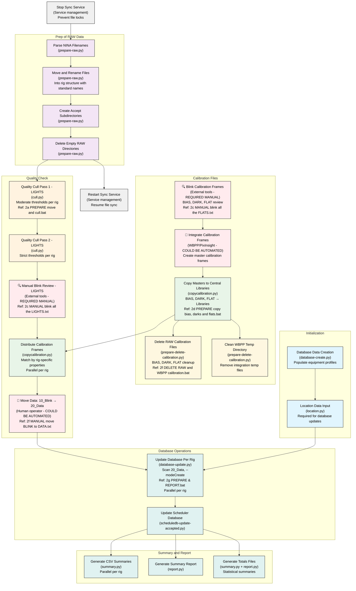

# Astrophotography Data Management Process Summary

This document outlines the complete functional process for managing astrophotography data from raw capture through organized archival.

## Process Overview

The process follows a sequence designed to transform raw NINA output into organized, quality-filtered, and database-tracked imaging data.

## Process Operation Sequence

The following Mermaid diagram shows the discrete operations and their dependencies. Operations that can run in parallel are shown at the same level, while sequential dependencies are connected with arrows.



- 🔍 REQUIRED MANUAL: Blink operations (lights and calibration)
- 🔄 COULD BE AUTOMATED: Calibration integration, Data movement (10_Blink → 20_Data)

## Discrete Operations Breakdown

### **Initialization** (Reference: `1a. UPSERT db astrophotography create with profiles.bat`)

#### **Database Data Creation**
- **Operation**: `database-create.py`
- **Purpose**: Creates/updates the astrophotography.sqlite database and populates equipment profiles
- **Dependencies**: None (initialization step)
- **Parallelization**: Sequential with Location Data Population

#### **Location Data Input**
- **Operation**: `location.py`
- **Purpose**: Populates location data tables required for database updates
- **Dependencies**: Database Data Creation
- **Parallelization**: None

---

### **Prep of RAW Data** (Reference: `2a. PREPARE move and cull.bat`)

#### **Parse NINA Filenames**
- **Operation**: `prepare-raw.py`
- **Purpose**: Extract metadata from NINA filename patterns
- **Dependencies**: RAW files from NINA
- **Parallelization**: None (sequential within prepare-raw.py)

#### **Move and Rename Files**
- **Operation**: `prepare-raw.py`
- **Purpose**: Move files into rig-based directory structure with standardized naming
- **Dependencies**: Parse NINA Filenames
- **Parallelization**: None (sequential within prepare-raw.py)
- **Note**: File move and rename happen simultaneously - destination path includes new filename

#### **Create Accept Subdirectories**
- **Operation**: `prepare-raw.py`
- **Purpose**: Create accept subdirectories for workflow
- **Dependencies**: Move and Rename Files
- **Parallelization**: None (sequential within prepare-raw.py)

#### **Delete Empty RAW Directories**
- **Operation**: `prepare-raw.py`
- **Purpose**: Clean up empty source directories and trigger service restart
- **Dependencies**: Create Accept Subdirectories
- **Parallelization**: None (sequential within prepare-raw.py)
- **Note**: Triggers sync service restart after RAW processing is complete

---

### **Calibration Files** (Reference: `2c. MANUAL blink all the FLATS.txt`, `2d. PREPARE copy bias, darks and flats.bat`, `2f. DELETE RAW and WBPP calibration.bat`)

#### **Blink Calibration Frames** (Required Manual)
- **Operation**: External blink software or PixInsight
- **Purpose**: Human review of BIAS, DARK, FLAT frames for quality and uniformity
- **Dependencies**: RAW calibration files available
- **Parallelization**: Can review different calibration types simultaneously
- **Note**: Instruction files currently empty, relies on operator experience

#### **Integrate Calibration Frames** (Could Be Automated)
- **Operation**: WBPP/PixInsight
- **Purpose**: Create master calibration frames from reviewed individual frames
- **Dependencies**: Blink Calibration Frames
- **Parallelization**: Can process different calibration types in parallel
- **Note**: Could be automated via WBPP/PixInsight scripting

#### **Copy Masters to Central Libraries**
- **Operation**: `copycalibration.py`
- **Purpose**: Archive master BIAS, DARK, FLAT from WBPP temp to central libraries
- **Dependencies**: Integrate Calibration Frames
- **Parallelization**: None (single operation)
- **Output Libraries**: `_Bias Library`, `_Dark Library`, `_Flat Stash`

#### **Delete RAW Calibration Files** (Independent cleanup)
- **Operation**: `prepare-delete-calibration.py`
- **Purpose**: Remove RAW calibration files after masters are safely archived
- **Dependencies**: Copy Masters to Central Libraries
- **Parallelization**: None (sequential: BIAS → DARK → FLAT)
- **Note**: Independent of main workflow, runs in parallel with other operations

#### **Clean WBPP Temp Directory** (Independent cleanup)
- **Operation**: `prepare-delete-calibration.py`
- **Purpose**: Clean WBPP temporary calibration directory
- **Dependencies**: Copy Masters to Central Libraries
- **Parallelization**: None
- **Note**: Independent of main workflow, runs in parallel with other operations

---

### **Quality Check** (Reference: `2a. PREPARE move and cull.bat`, `2c. MANUAL blink all the LIGHTS.txt`, `2d. PREPARE copy bias, darks and flats.bat`, `2f. MANUAL move BLINK to DATA.txt`)

#### **Quality Cull Pass 1 - LIGHTS** (Can run in parallel per rig)
- **Operation**: `cull.py` with moderate thresholds
- **Purpose**: Initial quality filtering with conservative thresholds
- **Dependencies**: Delete Empty RAW Directories
- **Parallelization**: Can run concurrently for each rig
- **Rig-Specific Configurations**:
  - **C8E@f10.0+ZWO ASI2600MM Pro**: HFR>4.6, RMS>2, auto=30%
  - **SQA55@f5.3+ATR585M**: HFR>4, RMS>2, auto=30%
  - **R135@f2.8+AP26CC**: HFR>4, RMS>2, auto=30%

#### **Quality Cull Pass 2 - LIGHTS** (Can run in parallel per rig)
- **Operation**: `cull.py` with strict thresholds
- **Purpose**: Aggressive cleanup with higher thresholds
- **Dependencies**: Quality Cull Pass 1 for same rig
- **Parallelization**: Can run concurrently for each rig
- **Rig-Specific Configurations**:
  - **C8E@f10.0+ZWO ASI2600MM Pro**: HFR>5.5, RMS>2, auto=100%
  - **Other rigs**: Similar strict cleanup approach

#### **Manual Blink Review - LIGHTS** (Required Manual)
- **Operation**: External blink software or PixInsight
- **Purpose**: Human review of LIGHT frames for quality and composition
- **Dependencies**: Quality Cull Pass 2 for respective rig
- **Parallelization**: Can review different rigs or targets simultaneously
- **Note**: Instruction files currently empty, relies on operator experience

#### **Distribute Calibration Frames** (Can run in parallel per rig)
- **Operation**: `copycalibration.py`
- **Purpose**: Copy appropriate calibration frames to each rig's `10_Blink` directory
- **Dependencies**: Manual Blink Review - LIGHTS AND Copy Masters to Central Libraries
- **Parallelization**: Can run concurrently for each rig
- **Rig-Specific Matching Properties**:
  - **C8E@f10.0+ZWO ASI2600MM Pro**: Standard properties (exposureseconds, settemp, camera, gain, offset, type)
  - **SQA55@f5.3+ATR585M**: Includes readoutmode property
  - **DWARFIII@f4.3+DWARFIII**: Simplified properties (no settemp), uses separate library subdirectories

#### **Move Data: 10_Blink → 20_Data** (Could Be Automated)
- **Operation**: Human operator
- **Purpose**: Move accepted data from `10_Blink` → `20_Data`
- **Dependencies**: Distribute Calibration Frames
- **Parallelization**: Can move different rigs/targets simultaneously
- **Note**: Could be automated based on completion criteria

---

### **Database Operations** (Reference: `2g. PREPARE & REPORT.bat`)

#### **Update Database Per Rig** (Can run in parallel per rig)
- **Operation**: `database-update.py --modeCreate`
- **Purpose**: Scan rig `20_Data` directories and update database with accepted imaging sessions
- **Dependencies**: Move Data: 10_Blink → 20_Data (data in `20_Data`)
- **Parallelization**: Can run concurrently for each rig
- **Current Rig Coverage**: C8E@f10.0+ZWO ASI2600MM Pro, SQA55@f5.3+ATR585M
- **Note**: Archive processing disabled due to .zip file handling limitations

#### **Update Scheduler Database**
- **Operation**: `scheduledb-update-accepted.py`
- **Purpose**: Update scheduler database with accepted counts from astrophotography database
- **Dependencies**: Update Database Per Rig
- **Parallelization**: None (single database operation)

---

### **Summary and Report** (Reference: `2g. PREPARE & REPORT.bat`)

#### **Generate CSV Summaries** (Can run in parallel per rig)
- **Operation**: `summary.py`
- **Purpose**: Generate CSV summaries from specific `20_Data` directories
- **Dependencies**: Update Scheduler Database
- **Parallelization**: Can run concurrently per rig

#### **Generate Summary Report**
- **Operation**: `report.py`
- **Purpose**: Generate summary reports across all data
- **Dependencies**: Update Scheduler Database
- **Parallelization**: None (single report operation)

#### **Generate Totals Files**
- **Operation**: `summary.py + report.py`
- **Purpose**: Generate statistical summaries and totals
- **Dependencies**: Update Scheduler Database
- **Parallelization**: Can run with other report generation

---

## Parallelization Opportunities Summary

### **High Parallelization Potential**
- **Quality Culling**: Each rig can be processed independently
- **Manual Blink Review**: Different rigs, targets, or frame types can be reviewed simultaneously  
- **Calibration Distribution**: Per-rig distribution can run concurrently
- **Database Updates**: Per-rig database scanning can run in parallel
- **Report Generation**: Summary generation per rig can run concurrently

### **Sequential Operations**
- **RAW Processing**: Internal operations within `prepare-raw.py` must be sequential
- **Service Management**: Sync service stop at beginning, restart after RAW processing complete
- **Cleanup Phase**: RAW calibration deletion must be sequential (BIAS → DARK → FLAT) but runs independently
- **Scheduler Database Update**: Single database operation

### **Manual Intervention Points**
- **Manual Blink Review**: Human operator review of LIGHTS and FLATS
- **Manual Move**: Operator moves data from `10_Blink` → `20_Data`

### **Data Flow Summary**
```
RAW (NINA Output)
    ↓ Initialization Phase + Stop Sync Service
    ↓ RAW Processing Phase + Restart Sync Service
    ↓ Quality Control Phase (Parallel per rig)
10_Blink (Organized, Quality Filtered)
    ↓ Manual Review Phase (Parallel per rig/type)
    ↓ Calibration Distribution Phase (Parallel per rig)
    ↓ Manual Move (Parallel per rig)
20_Data (Accepted Data)
    ↓ Database Update & Reporting Phase (Parallel per rig)
Database + Reports (Final State)

Independent Parallel Operations:
    ↓ Calibration Processing (Blink → Integrate → Archive)
    ↓ Cleanup Operations (RAW calibration deletion, WBPP cleanup)
```

## Operational Implementation Considerations

### **Automation vs Manual Operations**
- **Fully Automated**: File processing, quality culling, calibration distribution, database updates
- **Could Be Automated**: Calibration frame integration (via scripting), data movement between workflow stages
- **Human Required**: Visual quality assessment (blink operations), workflow progression decisions
- **System Integration**: Sync service coordination for file lock management

### **Scalability Design**
- **Per-Rig Parallelization**: Most operations designed to run independently per rig
- **Configurable Thresholds**: Quality parameters adjustable per equipment configuration
- **Modular Scripts**: Each operation implemented as discrete script with specific parameters

### **Batch File References for Implementation**
- **Initialization**: `1a. UPSERT db astrophotography create with profiles.bat`
- **Main Processing**: `2a. PREPARE move and cull.bat` 
- **Calibration**: `2d. PREPARE copy bias, darks and flats.bat`
- **Cleanup**: `2f. DELETE RAW and WBPP calibration.bat`
- **Reporting**: `2g. PREPARE & REPORT +Data+ update, accepted, csv and totals.bat`
- **Manual Steps**: `2c. MANUAL blink all the LIGHTS.txt`, `2c. MANUAL blink all the FLATS.txt`, `2f. MANUAL move BLINK to DATA.txt`

### **Current System Constraints**
- **Manual Documentation**: Some instruction files are empty, relying on operator knowledge
- **Rig-Specific**: Optimized for C8E@f10.0+ZWO ASI2600MM Pro, SQA55@f5.3+ATR585M, DWARFIII@f4.3+DWARFIII
- **Windows Dependency**: Batch scripts and file paths are Windows-specific

### **Future Enhancement Requirements**

#### **Cleanup and Maintenance Automation**
- **Automatic cleanup of unused calibration frames** in LIGHTS directories after processing
- **Automatic cleanup of empty LIGHTS directories** after blinking (when all files rejected)
- **Intelligent calibration frame lifecycle management** based on usage and age

#### **Process Automation Opportunities**
- **Automated data movement**: Replace manual 10_Blink → 20_Data movement with automated process
- **Automated calibration integration**: WBPP/PixInsight scripting could automate master frame creation
- **Note**: Manual blinking will always remain manual - requires human visual assessment for quality

#### **System Improvements**
- **Cross-platform compatibility**: Remove Windows-specific dependencies
- **Enhanced error handling**: Better recovery mechanisms for failed operations
- **Progress monitoring**: Real-time status tracking for long-running operations

### **Quality Assurance Framework**
- **Multi-Pass Filtering**: Progressive quality thresholds (moderate → strict)
- **Human Verification**: Manual blink review as final quality gate
- **Rig-Specific Parameters**: Equipment-appropriate quality thresholds
- **Parallel Reject Structure**: Recovery mechanism for over-aggressive filtering

## Integration Points

### **NINA Integration**
- Filename pattern parsing extracts equipment and quality metadata
- Directory structure accommodates NINA's output organization
- Quality metrics (HFR, RMS, star count) from NINA analysis

### **PixInsight Integration**
- WBPP temporary directory for calibration frame creation
- Accept directory structure compatible with WBPP batch loading
- Manual review often performed in PixInsight

### **Database Integration**
- Equipment profiles link to database entities
- Session tracking provides planning and analysis data
- Reporting enables progress monitoring and planning